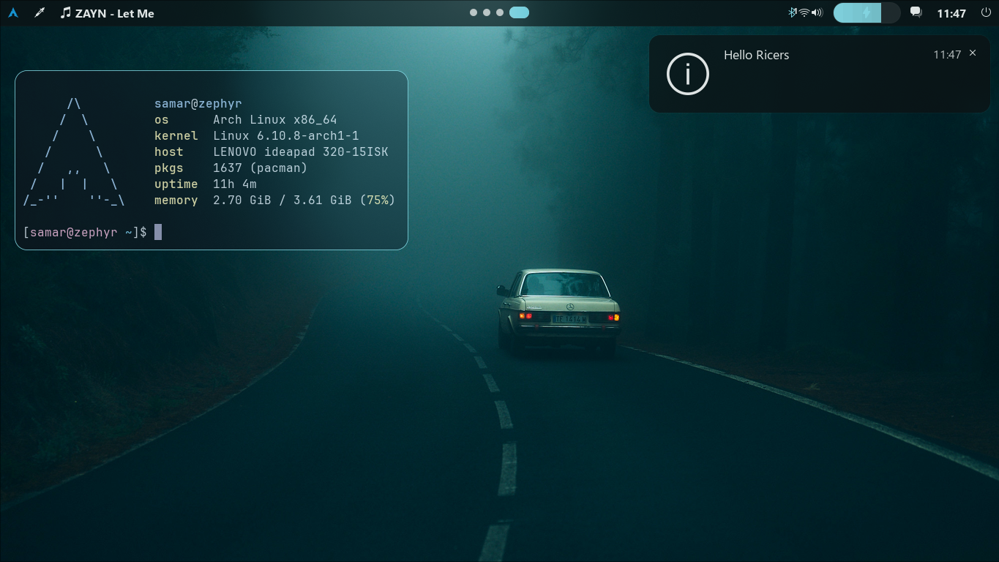
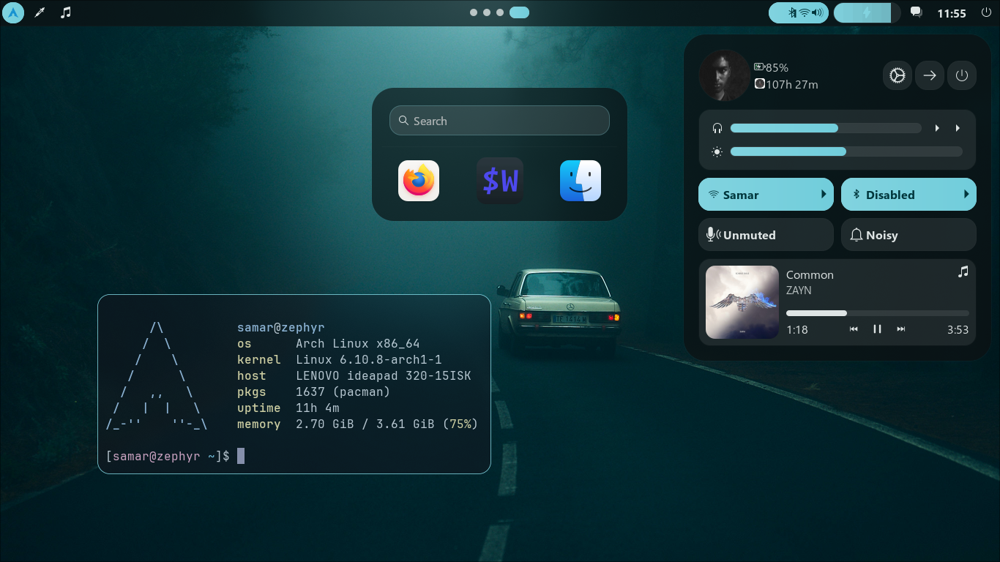
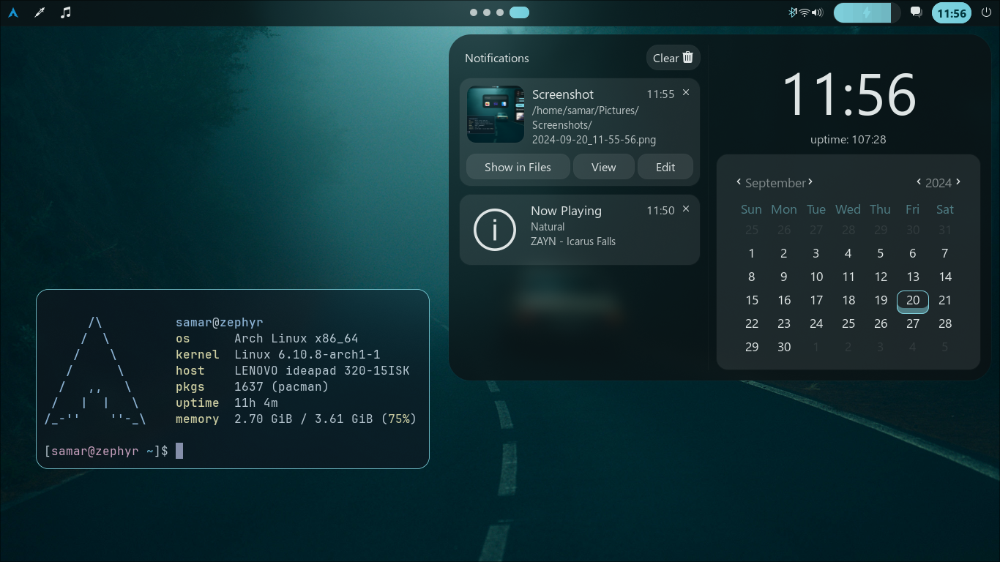

<h3 align="center">
  
</h3>

 
 
 

## Information
- **Operating System** • Arch Linux
- **Window Manager/DE** • Hyprland
- **Terminal** • wezterm
- **Shell** • zsh
- **Aur Helper** • yay
- **Panel** • ags
- **Launcher** • ags
- **File Manager** • nautilus
- **Notifications** • ags
- **Wallpaper Daemon** • swww
- **Text Editor** • neovim
- **Colorscheme** • Poimandres 

## ⚙️ Setup
  > [!WARNING]
  > This is a step by step guide for installing my dotfiles which is designed based on Arch Linux (and other Arch-based distributions). If you are running any other system, install the following packages with your respective OS's package manager.

