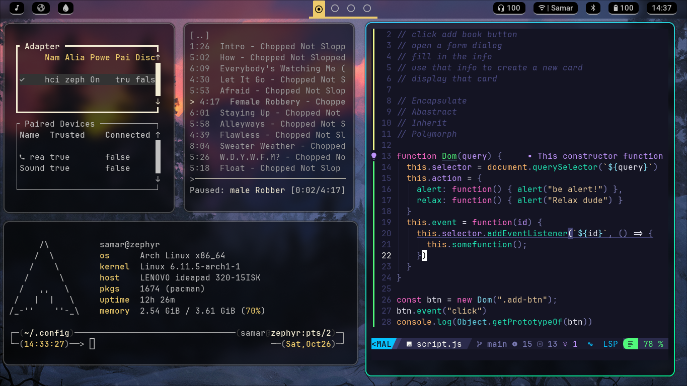
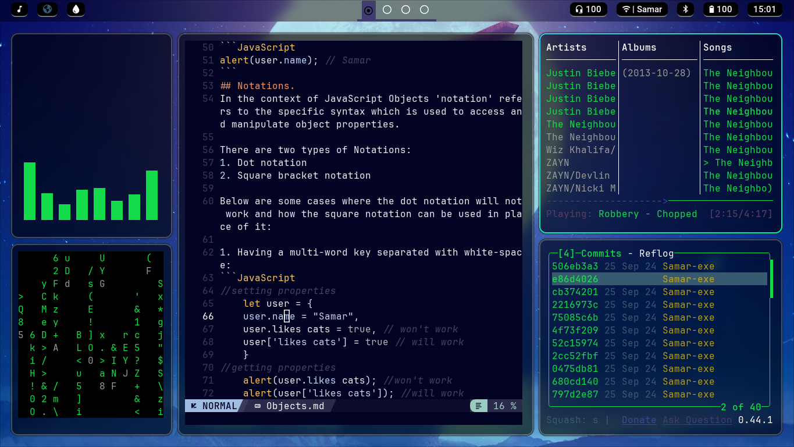

<h3 align="center">
  
</h3>

## Hyprland


 
 

## Features 

- Wallpaper switcher
- Colorscheme picker using pywal

## Information
- **Operating System** • Arch Linux
- **Window Manager/DE** • Hyprland
- **Terminal** • wezterm
- **Shell** • zsh
- **Aur Helper** • paru
- **Panel** • waybar
- **Launcher** • wofi
- **File Manager** • nautilus
- **Notifications** • dunst
- **Wallpaper Daemon** • swww
- **Text Editor** • neovim
- **Colorscheme** • Pywal 

## ⚙️ Setup
  > [!WARNING]
  > This is a step by step guide for installing my dotfiles which is designed based on Arch Linux (and other Arch-based distributions). If you are running any other system, install the following packages with your respective OS's package manager.

## Installing Hyprland

> [!NOTE]
> Even though I use arch and can build hyprland using yay, I have not done so. I have cloned the main repo from github in my .local/src directory and then compiled Hyprland. 

Now Assuming your aur helper is 'yay', follow the steps below:

1. Dependencies:
```bash
yay -S gdb ninja gcc cmake meson libxcb xcb-proto xcb-util xcb-util-keysyms libxfixes libx11 libxcomposite xorg-xinput libxrender pixman wayland-protocols cairo pango seatd libxkbcommon xcb-util-wm xorg-xwayland libinput libliftoff libdisplay-info cpio tomlplusplus hyprlang hyprcursor hyprwayland-scanner xcb-util-errors hyprutils-git
```

> [!WARNING]
> Some Dependencies that you might need 
>- aquamarine
>- hyprlang
>- hyprcursor
>- hyprwayland-scanner (build-only)

2. CMake (recommended)

```bash
git clone --recursive https://github.com/hyprwm/Hyprland
cd Hyprland
make all && sudo make install
```
> [!NOTE]
>For more Information please refer to the official hyprland documentation: [docs](https://wiki.hyprland.org/Getting-Started/Installation/) 

## Setting up my dotfiles.

> Cloning the repository into local system.

```bash
git clone https://github.com/Samar-exe/dotfiles.git
cd dotfiles
```
> Copy the configs to their respective directories. Don't forget to backup your previous configs!!

```bash
cp -r .config/* ~/.config/
```

> [!NOTE]
> For more information about individual modules check their README.md file that I have added in their own modules (WIP)


## TODO 

- Change bar from waybar to [astal](https://aylur.github.io/astal/guide/typescript/installation)  
- Making some nice utility widgets like, music controller, notification center using astal.
